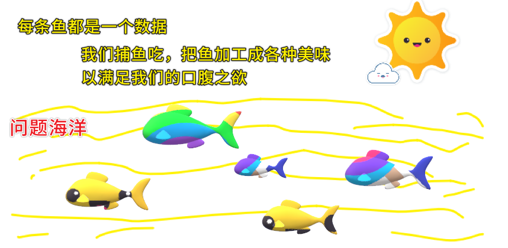
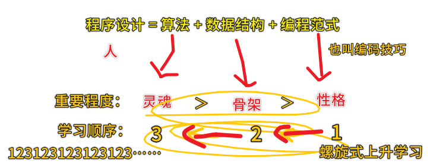
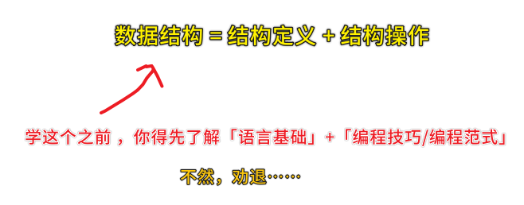
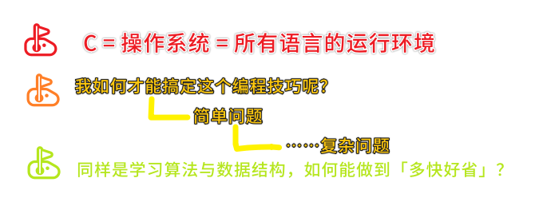

### ✍️ Tangxt ⏳ 2020-08-15 🏷️ 编程认识、语言选择

# 01-别闹了，学编程 ≠ 学语言、学习编程，我到底该选择哪门语言？、第一个程序：教你输出彩色的文字

## ★别闹了，学编程 ≠ 学语言

1）一个蕴含编程真谛的等式

老生常谈的等式：

> 程序 = 算法 + 数据结构

数据结构的作用，是**将问题中的相关数据，表示到计算机中**，算法则是**一套计算并且得到结果的流程**。

学会「数据的表示和数据的计算」就等于学会「写程序」 -> 知道「这是什么鱼和相应的佐料搭配」就等于学会「做鱼」

大多数人学习编程的姿势：

学习语言 -> 算法和数据结构 -> 劝退（明明知道思路，却无法用程序语言表达出来）

正确的姿势：

> 程序设计 = 算法 + 数据结构 + 编程范式

编码能力训练 -> 帮你把**分析具体问题的思路**转换成**代码的技巧**，也就是**实战写代码的能力** -> 解决你编程学习过程中，学了语言却写不出程序的尴尬局面，让你真正能够将思维变成代码

2）学习数据结构的等式

3）三个小目标

- 掌握 C 这门迁移性最好的语言，以便日后学习其他语言。理解了 C 语言，你就理解了操作系统，也就是理解了所有语言的运行环境。
- 掌握从简单的问题出发训练编程技巧的方法，为日后将思想转换成代码减少障碍。
- 掌握算法、数据结构学习的关键方法，为自学其他数据结构和算法打好基础。

4）学编程不等于学语言

编程学习就像是探索一片森林，**不同的人，会带你走不同的路线**。站在你面前的我，已经全副武装，就等着你的加入了，我将带你去到这片编程森林中最有趣的地方，你不来一起看看么？

> 有时候你以为这个人带你走了一段「最好」的路，但其实还有更好的路……或许，这就是编程的魅力所在吧！

5）Q&A

1、控制台彩色用的是什么操作系统？c 语言用的是什么标准？（c89 还是 c99 还是 c11）命名标准是下划线命名法还是驼峰命名法？windows 用什么编译工具啊？对电脑系统有要求嘛？需要 Linux？windows 下的 Linux 子系统可以吗？

- 操作系统会以 **Linux** 作为基础，不会教 windows-API
- C 的标准是 **C99**
- 编码规范方面的东西不会要求，以大家舒服的方式来写，即可。作者主要用**下划线命名法**。
- 最简单方便的，推荐 devcpp，一键安装无烦恼
- 最好是 Linux，windows 的话，也可以，除了颜色部分知识不兼容之外，其他都一样。
- win10 下面的 bash ubuntu 么？这个应该是可以的。

2、编程范式和设计模式的区别是什么？

1. 面向过程
2. 面向对象<——设计模式的作用范围
3. 范型编程
4. 函数式编程

“编程范式”是个什么概念？

你可以简单的理解成：如何设计程序。下面列几种编程范式，你参考一下：

- 面向过程：将代码封装成一个个的函数过程
- 面向对象：将问题中的数据抽象成一个个的对象，对应到程序中不同的类的设计
- 泛型编程：将程序过程中的类型做为变量，从具体的实现过程中抽象出来，编写更高级，通用性更强的程序过程。
- 函数式编程：函数做为程序中的一等公民，这个概念，你现在先不用太纠结。

3、Mac 电脑学 C 语言用什么 IDE 好？

推荐使用 Vim+gcc 的终端编程模式

> 学那个 VIM 专栏？

4、值得看的辅助教材？

权威一点的推荐《C 语言核心技术》，被称为牛书、啊哈 c 语言

5、面向小孩子的编程教育？

孩子的编程教育，有一个点可以放在对于『**计算机的工具属性**』的理解上，利如用计算机解决应用题

6、螺旋上升？

老菜鸟说一句，整个计算机科学+软件工程的学习中，总是存在“**先有鸡还是先有蛋**”的问题：理论需要实践，实践需要理论。能拿捏好“**螺旋上升**”的老师，都是好老师👍

7、自学了几种编程语言，也写过实际项目，但总觉得不成体系，学习过程中哪里有问题呢？

试着把自己掌握的技能，按照方向，整理成相关的知识图谱，试着总结一下。日后，再看到相关书籍的时候，就可以对应到自己相应技能知识图谱上的相关位置了。这样可以比较快速的形成一套属于自己的体系。

> 先找个完整的知识图谱……

8、怎么教？

希望作者能够帮忙多提炼一些算法题解的通用思路，分析一下为什么这么想。不同的解法对比的区别在哪里。

9、MATLAB 与 C 语言是相同的吗？学了一个以后可以更好的理解另一种吗？

一般会把 matlab 当成专有领域的编程语言，而没办法当成通常情况下我们所谓的编程语言。与 C 很不一样。可以说 matlab 的学习，不需要理解通常情况下编程问题中所说的编程环境的问题，也就是不需要理解什么是操作系统，什么是网络，什么是内存等。所以，可以说，matlab 与 C 语言的学习，两者对于对方的后续学习相关性很小。仅供参考。

10、会不会讲如何单元测试，这个也是开发人员的一个必备技能

篇幅有限，不会讲，但会讲如何做一个简易的测试框架。

11、算法+数据结构+编程范式。学习顺序应该是反过来的，所以如果 java 应该先学设计模式吗？

螺旋式上升学习

> 不需要把设计模式学得很牛逼了，再去学数据结构和算法…… -> 边学边用，反复学反复用

## ★学习编程，我到底该选择哪门语言？
