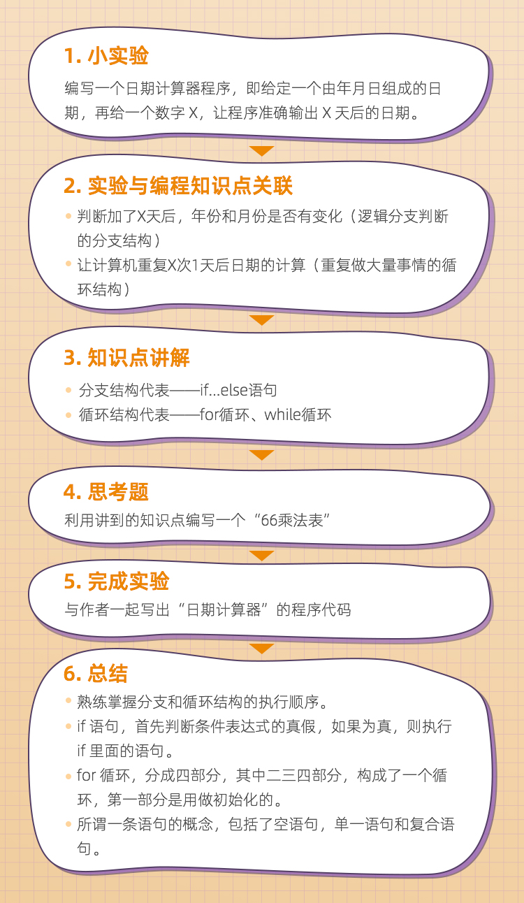

### ✍️ Tangxt ⏳ 2020-08-12 🏷️ 编程入门

# 01-人人都能学会的编程入门课

> [人人都能学会的编程入门课-极客时间](https://time.geekbang.org/column/intro/268)

## ★简介

很多初学者在学习编程的过程中遇到各种各样的困难。比如说：

- **语言学不透**，表层的语言特性能学会，可稍微深一点儿的思考就举步维艰，还有一些语言特性甚至彻底学不明白。
- **程序写不出**，很多计算机专业学生学了语言、算法数据结构，相关知识点掌握的也都挺明白，可一到要自己写程序了，总感觉被什么东西卡住，写不出来。
- **算法学不会**，算法与数据结构的学习，是编程学习的灵魂所在，可也是最难的一部分。很多初学者就是因为打开方式不正确，产生畏难情绪，最终学不会。

---

你将获得：

- 敲出人生第一段代码
- 30+ 有趣的编码项目体验
- 3000 行代码夯实编程基础
- 系统提高编程思维能力

---

文章结构：

---

专栏模块：

- **语言基础篇**：基于 C 具有良好迁移性的语言特性，带你进行一场有趣的基础知识学习之旅，让你轻松入门 C 语言，建立对编程的初步认知。
- **编码能力训练篇**：主要是解决很多人学会了语言却依然写不出程序的尴尬，作者会挑选一些特定的题目，减少你每次面临的陌生问题，带你循序渐进地提高编码能力。
- **算法数据结构篇**：经过“编码能力训练篇”的洗礼，带你更深层次地理解算法和数据结构，并掌握关键的学习方法，为你以后自学数据结构与算法打下基础。
- **综合项目篇**：帮你检验学习效果。作者通过 2 个小项目，带你去深入了解程序的内部结构，去理解代码为什么这么写，巩固学到的编程知识。

## ★目录

> 大概是3篇为一个`md`文件！

1）开篇词 & 语言基础篇

- [01-别闹了，学编程 ≠ 学语言、学习编程，我到底该选择哪门语言？、第一个程序：教你输出彩色的文字](./01.md)

